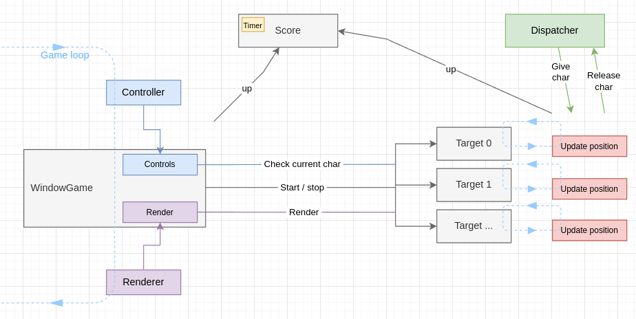

<h1 align="center">Kebb</h1>

Kebb is a game for keyboard enthusiasts which allows you to test and improve your typing skills. :rocket:  
Go to options to select the amount of letters, the speed and try to press all of the letters !

<!-- <div align="center"> -->
<div style="display: flex; justify-content: center; margin-bottom: 2px;">
  <span style="width: 45%; margin-right: 5px;" >  </span>
  <span style="width: 45%; margin-left: 5px;">  </span>
</div>

<div style="display: flex; justify-content: center; margin-top: 2px;">
  <span style="width: 45%; margin-right: 5px;" >  </span>
  <span style="width: 45%; margin-left: 5px;">  </span>
</div>

#### Dependencies

- **CMake >= 3.7**:
  - Debian: `apt install cmake`
  - All OSes: [CMake install](https://cmake.org/install/)
- **g++:**
  - Debian: `apt install build-essential`
  - Mac: [install Xcode command line tools to get make](https://developer.apple.com/xcode/features/)
  - Windows: [Click here for installation instructions](https://gnuwin32.sourceforge.net/packages/make.htm)
- **SDL >= 2.0:** with libsdl2-image libsdl2-ttf
  - Debian: `apt install libsdl2-dev libsdl2-ttf-dev libsdl2-image-dev`
  - All OSes: [SDL install](https://wiki.libsdl.org/SDL2/Installation)

#### Build

1. Clone this repo: `git clone https://github.com/flinguenheld/kebb`
2. Create a _build_ directory in the top level directory: `mkdir build && cd build`
3. Compile: `cmake .. && make`
4. Run: `./kebb`

#### Thanks

[Udacity snake game](https://github.com/udacity/CppND-Capstone-Snake-Game) that I used to start Kebb.  
Colors come from the [Catppuccin](https://github.com/catppuccin/catppuccin) Mocha theme. 😸
Fonts come from [1001 fonts](https://www.1001fonts.com/monospaced-fonts.html)
https://github.com/aminosbh/sdl2-cmake-modules

### Udacity criteria

---

#### Loops, Functions, I/O

##### 1. The project demonstrates an understanding of C++ functions and control structures.

You can find basic functions and structs in **./src/utils.cpp**.

##### 2. The project reads data from a file and process the data, or the program writes data to a file.

To manage options, I have created the class **OptionName**. This allows you to read/write a file named _options.kebb_.
There is one piece of information per line, each of them is a string.
To avoid useless open file repetitions, an instance is created in the **main.cpp** and shared with other objects.

##### 3. The project accepts user input and processes the input.

The user input is an important part of Kebb. You can see that in **./src/controller.cpp**.
So the program reads the input event at the beginning of the main loop and checks
if a target has the same value.  
However, I had to add a kind of interface to get rid of the char limitation.
With beautiful languages (like French for instance) there are too many characters.
You can see in **./src/utils.cpp** the current list of characters (in string) with an int as interface.  
The controller is in charge of the conversion according to the current pressed keys and the chosen layout.

---

#### Object Oriented Programming

##### 1. The project uses Object Oriented Programming techniques.

##### 2. Classes use appropriate access specifiers for class members.

##### 3. Class constructors utilize member initialization lists.

##### 4. Classes encapsulate behavior.

I used a lot of classes with the "Widgets" which allow you to easily display text/graphic stuff.

##### 5. Classes follow an appropriate inheritance hierarchy.

My widgets are all derived from **./src/widget/widget_base.h** (except WidgetWindow & WidgetMenu).  
It allows you to regroup the basic information and to use the polymorphism.  
I didn't use a pure virtual method to avoid any mandatory overriding.

❓Do you override the destructors ?

❓Is there a technique to overload an overrode method ? By this, I mean to add/change some arguments while keeping
the polymorphism ?

##### 6. Overloaded functions allow the same function to operate on different parameters.

##### 7. Derived class functions override virtual base class functions.

To keep the polymorphism, I mainly overrode instead of overloaded.  
You can see for instance the class WidgetSelection:

<p align="center">
  
</p>

- WidgetBase regroups the basic geometrics variables and the common methods (like render).
- WidgetTextBox allows you to display a one line text.
- WidgetSelection adds the ability to be selected and to change its color.
  (Used with the **./src/widget/widget_window.cpp** WidgetWindowSelection class).
- WidgetBoolean displays a button with two states.
- WidgetList displays a second textbox and allows you to make a selection from a list.

<p align="center">
  
</p>

##### 8. Templates generalize functions in the project.

I didn't see a useful utilization here. I'm interested in your point of view.  
(even though writing everything in the .h is ugly).

---

#### Memory Management

##### 1. The project makes use of references in function declarations.

I used some references to avoid useless copies especially in setters (in the **./src/widget/widget_base.h** for instance).  
However a lot of exchanged values here are small.  
Like int, bool or struct of two int, so I'm not sure if that is useful.

##### 2. The project uses destructors appropriately.

As said in the doc, I created a virtual destructor for all classes which use polymorphism.  
However, thanks to smart pointers, I didn't need to use destructors except for the renderer which allows you to
liberate the SDL objects (**./src/renderer.h**).

##### 3. The project uses scope / Resource Acquisition Is Initialization (RAII) where appropriate.

##### 4. The project follows the Rule of 5.

I hope I'm not wrong because I didn't see any utilization of the copy and even less the move constructor here.
Could you give me some examples where they could be useful in this project ?

##### 5. The project uses move semantics to move data, instead of copying it, where possible.

I used some move semantics to move strings:  
**src/option/window_option.cpp:159:29**  
**src/widget/button/widget_list.cpp:7:46**  
**src/widget/button/widget_list.cpp:7:46**

But honestly I can't really figure out if it has a real impact on performance.

##### 6. The project uses smart pointers instead of raw pointers.

Oh yes, smart pointers are so powerful. I used them everywhere, to share the Controller or Options objects for instance.  
But more importantly, they work with polymorphism, so I used them with all of my widgets.  
For example, the class **WidgetWindowSelection** has a vector of unique_ptr<WidgetSelection>.  
And these unique_ptr can be a WidgetBoolean or a WidgetList.

Another good example is in the **./src/loop.cpp**. The game loop is in charge of jumping between windows.  
The current window is a shared_ptr which receive several shared_ptr itself.

❓ By the way, is it safe to erase a shared_ptr ?

```
auto my_shared_ptr = std::make_shared<foo>();
...
my_shared_ptr.reset(); // <- Mandatory ?

my_shared_ptr = std::make_shared<foo2>(15, 50); // <- Safe ?
```

As for the rule of 5, I didn't use the weak_ptr here.

---

#### 7. Concurrency

<p align="center">
  
</p>

1. The project uses multithreading.

Yes, the main idea of Kebb is based on multithreading.
The game loop creates a WindowGame which creates (according to options) a vector of class threads.  
These threads (**./src/game/target.h**) launch an infinite loop which:

- asks a character to the dispatcher
- asks an angle to the dispatcher
- calculates the target position & color
- updates score if miss or success

2. A promise and future is used in the project.

No, threads are independent and they have to be stopped by WindowGame (when the timer is over, or user escape).

3. A mutex or lock is used in the project.

Yes, the dispatcher and the score objects are shared (thanks to a shared_ptr) with all targets
so I used several unique_lock in their assessors:
**./src/game/dispatcher.cpp**
**./src/score/score.h**

4. A condition variable is used in the project.

No, I didn't need to synchronise threads, when WindowGame stops them, it just does a join().

---

:pushpin:  
I used the multithreading mainly to work on it and I discovered in the [lazy foo tutorial](https://lazyfoo.net/tutorials/SDL/46_multithreading/index.php) that generally it's a beginner cliché and rarely justified.  
Could you give me your opinion about the utility of multithreading in this project ?

Thank you.
