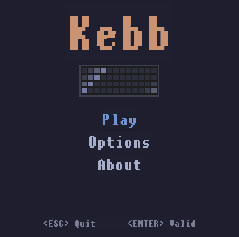
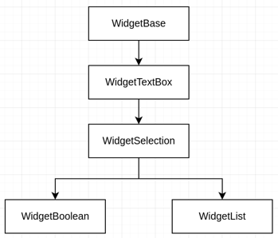
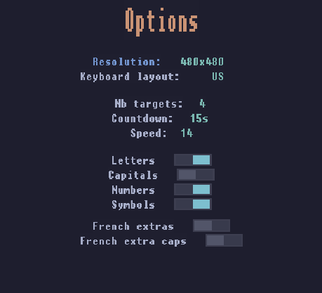

# kebb

Kebb is a game for keyboard enthusiasts which allows to test and improve your typing skills.  
Go to options to select the amount of letters, the speed and try to press all of them !

  
  

#### Dependencies

- [CMake](https://cmake.org/install/) >= 3.7: `apt install cmake`
- g++: `apt install build-essential`
- [SDL](https://wiki.libsdl.org/SDL2/Installation) >= 2.0: `apt install libsdl2-dev libsdl2-ttf-dev libsdl2-image-dev`

#### Build

1. Clone this repo: `git clone https://github.com/flinguenheld/kebb`
2. Create a _build_ directory in the top level directory: `mkdir build && cd build`
3. Compile: `cmake .. && make`
4. Run: `./kebb`

#### Thanks

Colors come from the [Catppuccin](https://github.com/catppuccin/catppuccin) Mocha theme.

### Udacity criteria

---

#### Loops, Functions, I/O

##### 1. The project demonstrates an understanding of C++ functions and control structures.

You can find basic functions and structs in **./src/utils.cpp**.

##### 2. The project reads data from a file and process the data, or the program writes data to a file.

To manage options, I have created the class **OptionName**. The latter allows to read/write a file named _options.kebb_.
There is one information per line, each information is a string.
To avoid useless open file repetition, an instance is created in the **main.cpp** an shared with other objects.

##### 3. The project accepts user input and processes the input.

The user input is an important part of kebb. You can see that in **./src/controller.cpp**.
So the program reads the input event at the main loop beginning and check if a target has the same value.
However, I had to add a kind of interface because to get rid of the char limitation.
With beautiful languages (like French for instance) there are too much characters.
You can see in **./src/utils.cpp** the current list of characters (in string) with a code.  
The controller is in charge to do the conversion according to the current press keys and the chosen layout.

---

#### Object Oriented Programming

##### 1. The project uses Object Oriented Programming techniques.

##### 2. Classes use appropriate access specifiers for class members.

##### 3. Class constructors utilize member initialization lists.

##### 4. Classes encapsulate behavior.

I used a lot of classes with the "Widgets" which allow to easily display text/graphic stuffs.

##### 5. Classes follow an appropriate inheritance hierarchy.

My widgets are all derived from **./src/widget/widget_base.h** (except WidgetWindow & WidgetMenu).
It allows to regroup the basic information and to use the polymorphism.
I didn't use a pure virtual function to avoid any mandatory overriding.

<!-- FIX: Use or not the overriding keyword ? -->
<!-- TODO: schema -->

##### 6. Overloaded functions allow the same function to operate on different parameters.

##### 7. Derived class functions override virtual base class functions.

To keep the polymorphism, I mainly overrided instead of overloaded.
You can see for instance the class WidgetSelection:

  

- WidgetTextBox allows to display a one line text.
- WidgetSelection adds the ability to be selected and change its color.
  (Used with the **./src/widget/widget_window.cpp** WidgetWindowSelection class).
- WidgetBoolean displays a button with two states.
- WidgetList display a second textbox and allows to do a selection in a list.

  

##### 8. Templates generalize functions in the project.

I didn't see a useful utilization here. I'm interested in your point of view.  
(even if the fact of writing everything in the .h is ugly).

---

#### Memory Management

##### 1. The project makes use of references in function declarations.

I used some references to avoid useless copies especially in setters.  
In the **./src/widget/widget_base.h** for instance. However a lot of exchanged values here are small.
Like int or bool (or struct of two int) so I not sure that is very useful.

##### 2. The project uses destructors appropriately.

As said in the doc, I created a virtual destructor for all classes which use polymorphism.
However, thanks to smart pointers, I didn't use destructors except for the renderer which allows to
liberate the SDL objects (**./src/renderer.h**).

##### 3. The project uses scope / Resource Acquisition Is Initialization (RAII) where appropriate.

##### 4. The project follows the Rule of 5.

I hope I'm not wrong because I don't see any utilization of the copy and even less the move constructor here.
Could you give me example which can be useful ?

##### 5. The project uses move semantics to move data, instead of copying it, where possible.

I use some move semantics to move string:  
**src/option/window_option.cpp:159:29**  
**src/widget/button/widget_list.cpp:7:46**  
**src/widget/button/widget_list.cpp:7:46**

But honestly I can't really figure out if it have a real impact on performances.

##### 6. The project uses smart pointers instead of raw pointers.

Oh yes, smart pointers are so powerful. I used them everywhere, to share the Controller or Options objects for instance.  
But more important, they work with polymorphism, so I used them with all of my widgets.  
The class WidgetWindowSelection has a vector of unique_ptr<WidgetSelection>. And these unique_ptr can be a WidgetBoolean or a WidgetList.

Another good example is in the **./src/main.cpp**. The main loop is in charge of jumping between windows. The current window is a shared_ptr which receive several shared_ptr itself.

As for the rule of 5, I didn't use the weak_ptr here.

---

#### Concurrency

1. The project uses multithreading

Yes, the main idea of Kebb is based on multithreading.
