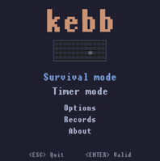
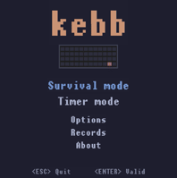
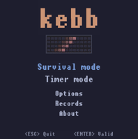

<h1 align="center">Kebb</h1>

Kebb is a game for keyboard enthusiasts which allows you to test and improve your typing skills. :rocket:  
Go to options to select the amount of letters, the speed and try to press all of the letters !

It currently works with QWERTY, AZERTY and BÉPO layouts.

   
   

   
   

---

#### Install from package

Pre-built package for Debian is available on the [Releases](https://github.com/flinguenheld/kebb/releases) page.

---

#### Manual install

##### Dependencies

- **CMake >= 3.7**:
  - [CMake install](https://cmake.org/install/)
- **g++:**
  - Mac: [install Xcode command line tools to get make](https://developer.apple.com/xcode/features/)
- **SDL (>= 2.0.12):**
  - All OSes: [SDL install](https://wiki.libsdl.org/SDL2/Installation)
- **SDL TTF (>= 2.0.15):**
  - Find the package name or see the [github repository](https://github.com/libsdl-org/SDL_ttf)

##### Build

1. Clone this repo: `git clone https://github.com/flinguenheld/kebb`
2. Create a _build_ directory in the top level directory: `mkdir build && cd build`
3. Compile: `cmake -DRELEASE_LINUX=ON .. && make`
   > :bulb: The flag RELEASE_LINUX=OFF allows to use the fonts and option files in the build folder.
4. Run: `./kebb`

---

#### Thanks

Colors come from the [Catppuccin](https://github.com/catppuccin/catppuccin) Mocha theme. 😸  
Fonts come from [1001 fonts](https://www.1001fonts.com/monospaced-fonts.html)  
[SDL2 CMake modules](https://github.com/aminosbh/sdl2-cmake-modules)  
[Udacity snake game](https://github.com/udacity/CppND-Capstone-Snake-Game) that I used to start.
